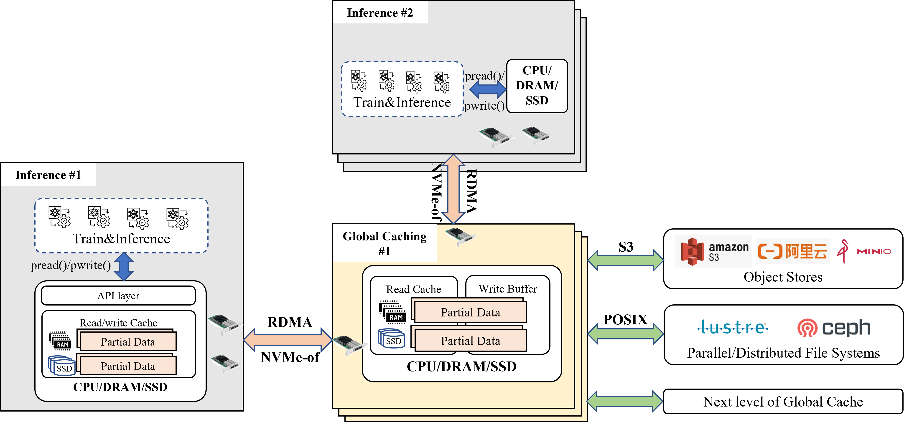

# JYCache, powered by 9#AISoft
# test1

[中文说明](README.zh.md)

**JYCache** is a distributed caching storage system, designed for both personal use and large-scale data processing and analysis (e.g. LLM training and inference). **JYCache** supports various storage types, including object storage and parallel file systems.It offers high performance and better scalability. 
**JYCache** has integrated optimizations such as hierarchical caching, context-switch free access layer, and asynchronous I/O. 

JYCache supports operation on X86 and ARM architectures.
It also outperforms Alluxio in I/O performance (see below). 

## Running mode
JYCache provides the following two running modes:

- **Standalone Acceleration**: Mount S3 object storage locally via POSIX interface, enabling read and write access like a local disk. A raw object on S3 maps to a "file" locally, structured into a directory tree based on the object name. Furthermore, hot data can be cached in local DRAM/SSD, improving file system performance by reducing interaction with S3.

- **Distributed Object Acceleration**: Hot data presents a two-level cache structure; in addition to client-side internal DRAM/SSD caches, a shared DRAM/SSD cache is provided, further increasing cache hit rates and enhancing I/O performance under concurrent read scenarios.

## Key Features
- **POSIX Interface Compatibility**: Applications can immediately achieve caching storage acceleration without recompilation using FUSE or dynamic library interception techniques.
- **HA-enabled Cache Write**: Data written to the cache layer is considered persistent, utilizing multi-replication and erasure coding mechanisms for high availability of data within the cache layer, thereby reducing pressure on lower storage systems and improving I/O performance.
- **User-Space Zero-Copy I/O Support**: The syscall intercept technique enables full user-space I/O, reducing context switching and copying, thus achieving extreme performance.
- **Hierarchical Cache Storage**: Local caches are co-located with computation tasks, using high-speed shared caches to provide user processes with up to 45GB/s of cache bandwidth. To further enhance caching efficiency in distributed systems, a global caching service can be deployed to associate with multiple local caches, boosting cache hit rates.
- **Easy to Scale and Integrate**: Local and global caches use a modular design, allowing for diverse combinations based on business needs.
- **Multi-Platform Compatibility**: Supports operation on X86 (Intel, AMD, Hygon, etc.) and ARM (Kunpeng, Feiteng, etc.) platforms.

## Architecture



## Performance

**Sequential Read (FIO benchmark)**

|  BS | Before Optimization  | JYCache(FUSE) | JYCache(intercept) | 
| ------------ | ------------ | ------------ | ------------ | 
|  4K | 761MiB/s  |  933MiB/s | 3576MiB/s |
|  16K | 706MiB/s | 3643MiB/s  | 11.6GiB/s |
|  128K | 2268MiB/s  |  22.6GiB/s | 38GiB/s |

**Sequential Write (FIO benchmark)**

|  BS | After Optimization  | JYCache(FUSE) | JYCache(intercept) | 
| ------------ | ------------ | ------------ | ------------ | 
|  4K | 624MiB/s  |  1226MiB/s | 2571MiB/s | 
|  16K |  2153MiB/s | 5705MiB/s  | 9711MiB/s | 
| 128K  | 7498MiB/s  | 23.5GiB/s  | 31.2GiB/s |

## Build
**Software Dependencies**

- GCC 9.3.0
- GLIBC 2.31
- CMake 3.7
- C++ 17
- FUSE >= 2.6

**Build from Source Code**

Run `build.sh` in root directory:
```bash
sh build.sh
```
*Third-party dependencies will be downloaded during executing build.sh. So network connection is required.*

**Install**

After compilation，Run `install.sh` in root directory:
```bash
sh install.sh
```

## Quick Start

After executing the install.sh script, the JYCache environment will be built in the current directory, which is JYCache_Env. The following methods all use JYCache_Env as the root directory.

### Standalone (w/o Global Caching)

Change `conf/newcache.conf` and set `UseGlobalCache=0`
```bash
# 1.start minio
cd ./minio && sh start.sh && cd ..
# 2.start client
sh start_s3fs.sh
```

After startup, file operations under the mounted directory ./mnt are controlled by JYCache.

*Note: In this mode, you need to create the folder `testdir` in the mount directory `./mnt` in this mode, which is required for accept mode.*

**Stop Service**
```bash
sh stop_s3fs.sh
cd ./minio && sh stop.sh && cd ..
```

### Distributed (w/ Global Caching)

Change `conf/newcache.conf` and set `UseGlobalCache=1`
```bash
# 1.start minio
cd ./minio && sh start.sh && cd ..
# 2.start etcd
sh start_etcd.sh
# 3.start global cache
sh start_global.sh
# 4.start client
sh start_s3fs.sh
```
After startup, file operations under the mounted directory ./mnt are controlled by JYCache.

**Stop Service**
```bash
sh stop_s3fs.sh
sh stop_global.sh
sh stop_etcd.sh
cd ./minio && sh stop.sh && cd ..
```

### Enabling intercept POSIX (w/ and w/o Global Caching)

The following illustrate how to use intercept POSIX API w/o Global Caching:
```bash
# 1.start minio
cd ./minio && sh start.sh && cd ..
# 2.start intercept_server
sh start_intercept_server.sh
```
After startup is complete, in the JYCache_Env root directory, execute:
```bash
LD_LIBRARY_PATH=./libs/:$LD_LIBRARY_PATH  LD_PRELOAD=./libintercept_client.so ${cmd}
```
Example:
```bash
LD_LIBRARY_PATH=./libs/:$LD_LIBRARY_PATH  LD_PRELOAD=./libintercept_client.so ll /testdir/
```
You need to perform file operations in the `testdir` directory to be controlled by JYCache intercept mode.
*You need to create the folder `testdir` in the mounted directory in normal mode before using intercept mode.*

**Stop Service**
```bash
sh stop_intercept_server.sh
cd ./minio && sh stop.sh && cd ..
```

## FAQ

[常见问题(仅中文版本)](https://www.osredm.com/jiuyuan/JYCache/tree/master/doc/frequently_asked_questions.md)

## Permission

This project uses the following code that follows the GPLv2 license:
- S3FS (https://github.com/s3fs-fuse/s3fs-fuse)

This software is licensed under the GNU GPL version 2.

